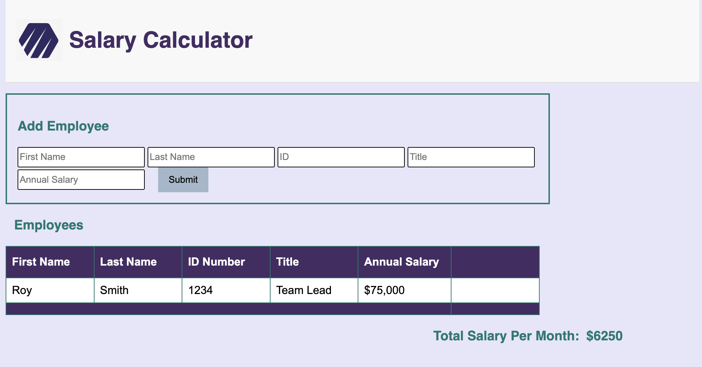

# JS Monthly Salary Calculator

## Description
Duration: *Weekend Challenge*

This app takes in employee information such as name, ID, and annual salary, and calculates the total **monthly** salary expenditure for all employees. Employee information entered into the clearly labeled fields are rendered into an easy to read table. If the information of an employee needs to be removed for any reason, a delete button next to each employee is provided. Additionally, the app highlights montly expenditures that exceed $20,000. 

Current app limitation: The app currently does not correctly update the monthly salary expenditure when an employee is removed. Additionally, an example employee comes preloaded and is not removable. 

## Screenshot

### Prerequisites
None 

## Usage
1. Enter each employee's details into each of the 5 provided input boxes (*employee details include first and last name, employee ID, title at the company, and annual salary) and click submit.
2. If an employee's details are incorrect or need to be removed for any reason, click the delete button corresponding with the line of employee information that needs to be removed. 

## Acknowledgement
Many thanks to David and Blaine from Emerging Digital Academy who provided the tools and support to make this app. 

## Support 
If you have suggestions or issues, please email me at youremail@whatever.com